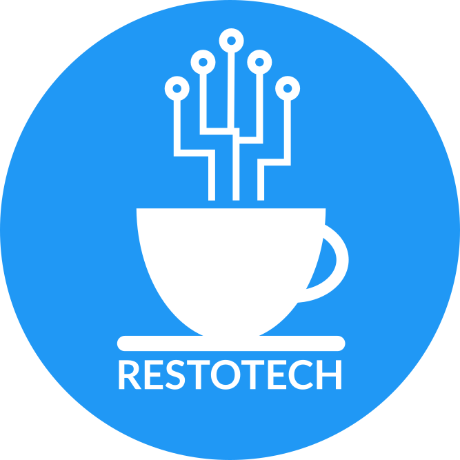

<p><b><h1>Software sistem manajemen restoran dan POS</h1></b></p>

<p>Created using <a href="https://www.yiiframework.com/">Yii2 Framework</a></p>
<p>Using <a href="https://mariadb.org/">MariaDB as Database</a></p>

--------------------------------------------------------

Run composer update first

Create file `generate/backend/config/params-local.php`
```php
return [
    'database' => [
        'user' => 'this-is-username-of-your-database',
        'password' => 'this-is-password-of-your-database'
    ]
];
```

Then locate `template/engine/common/config/bootstrap.php` and change the root URL config

Create folder `template/assets`
Create folder `template/admin/assets`

Connect to address `http://your-site/generate/backend/web` for generating new restaurant`
